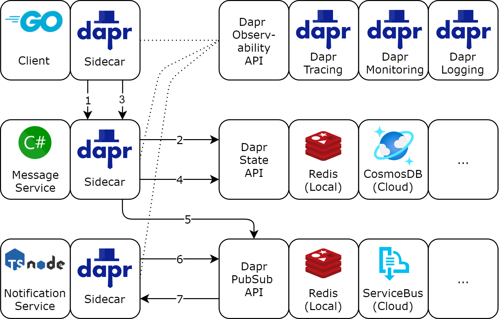

# Dapr demo

This repository contains a simple demo that shows how [Dapr](https://dapr.io/) *simplifies the implementation of polyglot microservices* and how Dapr makes it possible *to switch between different deployment environments* without changing the application code.

The demo consists of three applications.

- **Client**: Written in _Go_, uses dapr **service invocation** to talk to the MessageService over _GRPC_.
- **MessageService**: Written in _C# .NET 5_, uses dapr **state management** to persist state and also uses the **publish & subscribe** building block to publish messages.
- **NotificationService**: Written in _TypeScript / Node.js_, uses the **publish & subscribe** building block to subscribe on messages from the MessageService and outputs them on the console.



## Changing the deployment environment with Dapr

The demo shows how Dapr enables polyglot microservices to be run in different environments (e.g. local and cloud) without changing a line of application code.
For this purpose the demo uses different third party components for each environment.

Third party components used in local environment:

- Redis (State store and message broker)
- Zipkin (Distributed Tracing)

Third party components used in cloud environment:

- Azure CosmosDB (State store)
- Azure Service Bus (Message broker)
- Azure Application Insights with OpenTelemetry collector (Distributed Tracing)

## Run the demo in Kubernetes

The Dapr components definitions for running the demo on Kubernetes are located in the `/dapr/kubernetes/` directory.

### Run on AKS using Azure services

Follow these steps to run the Dapr demo on Azure Kubernetes Service (AKS) using Azure services as third party components.

#### Prerequisites for Kubernetes deployment on Azure Cloud

To run the Dapr demo on Kubernetes in Azure, you need running instances of the following services.

- Azure Kubernetes Service with installed Dapr ([Deploy Dapr on a Kubernetes cluster](https://docs.dapr.io/operations/hosting/kubernetes/kubernetes-deploy/))
- Azure CosmosDB ([Dapr Docs for Azure CosmosDB setup](https://docs.dapr.io/reference/components-reference/supported-state-stores/setup-azure-cosmosdb/))
- Azure Service Bus ([Dapr Docs for Azure Service Bus setup](https://docs.dapr.io/reference/components-reference/supported-pubsub/setup-azure-servicebus/))
- Azure Application Insights ([Dapr Docs on using Application Insights with OpenTelemetry Collector](https://docs.dapr.io/operations/monitoring/tracing/open-telemetry-collector-appinsights/))
- kubectl

Additionally, you will need to create kubernetes secrets to connect to the azure services.
Set the required parameters as value.
Refer to the Dapr Docs for details on connection parameters.

- Create a kubernetes secret named ``cosmos-db-secrets`` with the following keys:
  - url
  - masterKey
  - database
  - collection
- Create a kubernetes secret named ``servicebus-secrets`` with the following key:
  - connectionString
- Configure the ``instrumentation_key`` in the `dapr-demo-application-insights.yaml` file by replacing ``<REPLACE-WITH-INSTRUMENTATION-KEY>`` with your Azure Application Insights instrumentation key. **Be careful to not accidentally commit your instrumentation key!**

#### Deployment on AKS

Connect to your AKS cluster and switch kubectl context to your AKS cluster.
Then run the following command.

```bash
kubectl apply -f ./dapr/kubernetes/cloud
```

### Run on local Kubernetes cluster using local components

Follow these steps to run the Dapr demo on a local Kubernetes cluster using local third party components.

#### Prerequisites for local Kubernetes deployment

- Kubernetes with installed Dapr ([Deploy Dapr on a Kubernetes cluster](https://docs.dapr.io/operations/hosting/kubernetes/kubernetes-deploy/))
- Redis ([Dapr Docs instructions for installing Redis in Kubernetes](https://docs.dapr.io/getting-started/configure-state-pubsub/#create-a-redis-store))
- kubectl

#### Deplyoment on local Kubernetes cluster

```bash
kubectl apply -f ./dapr/kubernetes/local
```

## Run the demo in self-hosted mode

The Dapr components definitions for running the demo in self-hosted mode are located in the `/dapr/self-hosted/` directory.

### Prerequisites for self-hosted deployment using cloud components

To run the Dapr demo in self-hosted mode using cloud components, you will need the following prerequisites:

- [.NET 5.0](https://dotnet.microsoft.com/download/dotnet/5.0)
- [Go](https://golang.org/)
- [Node.js with NPM](https://nodejs.org/en/)
- [Dapr](https://dapr.io/)
- Azure CosmosDB ([Dapr Docs for Azure CosmosDB setup](https://docs.dapr.io/reference/components-reference/supported-state-stores/setup-azure-cosmosdb/))
- Azure Service Bus ([Dapr Docs for Azure Service Bus setup](https://docs.dapr.io/reference/components-reference/supported-pubsub/setup-azure-servicebus/))

Rename the provided `dapr-demo-secrets-store.json.example` file to `dapr-demo-secrets-store.json` and fill in the parameters required to connect to the components.

Additionally, you will have to **install the necessary npm packages** of the notificationservice:

```powershell
cd ./services/notificationservice
npm install
```

### Run in self-hosted mode using cloud components

Start the services in the following order and wait until you see `You're up and running! Both Dapr and your app logs will appear here.` as output before starting the next service.

#### Start the notificationservice using cloud components

If you are on Windows or if you have PowerShell Core installed, you can use the `run-notification-service.ps1` to start the application:

```powershell
cd ./dapr/self-hosted/cloud
./run-notification-service.ps1
```

Otherwise, start the application using the dapr cli:

```bash
cd ./services/notificationservice
dapr run `
  --app-id dapr-demo-notification-service `
  --app-port 5005 `
  --components-path ../../dapr/self-hosted/cloud `
  npm run start
```

#### Start the messageservice using cloud components

If you are on Windows or if you have PowerShell Core installed, you can use the `run-message-service.ps1` to start the application:

```powershell
cd ./dapr/self-hosted/cloud
./run-message-service.ps1
```

Otherwise, start the application using the dapr cli:

```bash
cd ./services/messageservice
dapr run `
    --app-id dapr-demo-message-service `
    --app-port 5002 `
    --app-protocol grpc `
    --components-path ../../dapr/self-hosted/cloud `
    dotnet run
```

#### Start the client using cloud components

If you are on Windows or if you have PowerShell Core installed, you can use the `run-client.ps1` to start the application:

```powershell
cd ./dapr/self-hosted/cloud
./run-client.ps1
```

Otherwise, start the application using the dapr cli:

```bash
cd ./services/client
dapr run `
    --app-id dapr-demo-client `
    --components-path ../../dapr/self-hosted/cloud `
    go run main.go
```

### Prerequisites for self-hosted deployment using local components

To run the Dapr demo in self-hosted mode using local components, you need the following prerequisites:

- [.NET 5.0](https://dotnet.microsoft.com/download/dotnet/5.0)
- [Go](https://golang.org/)
- [Node.js with NPM](https://nodejs.org/en/)
- [Dapr](https://dapr.io/)
- Redis (Automatically installed with Dapr)

Rename the provided `dapr-demo-secrets-store.json.example` file to `dapr-demo-secrets-store.json` and fill in the parameters required to connect to the components.

Additionally, you will have to **install the necessary npm packages** of the notificationservice:

```powershell
cd ./services/notificationservice
npm install
```

### Run in self-hosted mode using local components

Start the services in the following order and wait until you see `You're up and running! Both Dapr and your app logs will appear here.` as output before starting the next service.

#### Start the notificationservice using local components

If you are on Windows or if you have PowerShell Core installed, you can use the `run-notification-service.ps1` to start the application:

```powershell
cd ./dapr/self-hosted/local
./run-notification-service.ps1
```

Otherwise, start the application using the dapr cli:

```bash
cd ./services/notificationservice
dapr run `
  --app-id dapr-demo-notification-service `
  --app-port 5005 `
  --components-path ../../dapr/self-hosted/local `
  npm run start
```

#### Start the messageservice using local components

If you are on Windows or if you have PowerShell Core installed, you can use the `run-message-service.ps1` to start the application:

```powershell
cd ./dapr/self-hosted/local
./run-message-service.ps1
```

Otherwise, start the application using the dapr cli:

```bash
cd ./services/messageservice
dapr run `
    --app-id dapr-demo-message-service `
    --app-port 5002 `
    --app-protocol grpc `
    --components-path ../../dapr/self-hosted/local `
    dotnet run
```

#### Start the client using local components

If you are on Windows or if you have PowerShell Core installed, you can use the `run-client.ps1` to start the application:

```powershell
cd ./dapr/self-hosted/local
./run-client.ps1
```

Otherwise, start the application using the dapr cli:

```bash
cd ./services/client
dapr run `
    --app-id dapr-demo-client `
    --components-path ../../dapr/self-hosted/local `
    go run main.go
```

## Output

If everything was setup up correctly, you should see the following output of the notificationservice with an increasing counter. The output is the same for all deployment variants.


